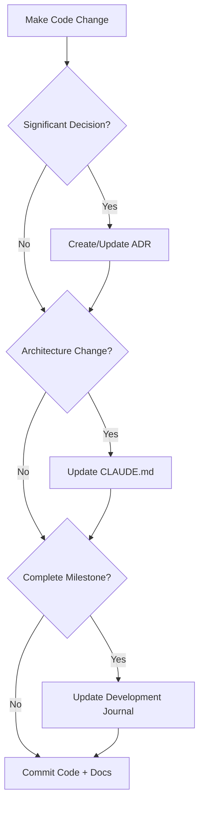

# Claude Code Instructions for Documentation

This file provides specific guidance to Claude Code when working with documentation in this repository.

## Documentation Philosophy

This project maintains comprehensive documentation to ensure:
- **Knowledge Transfer**: Future developers can understand decisions and context
- **Decision Tracking**: Significant choices are documented with rationale
- **Development History**: Clear record of what was built, why, and how
- **AI Assistant Context**: Rich context for Claude and other AI assistants

## Documentation Standards

### Required Documentation for Code Changes

When making code changes, Claude Code should proactively create/update documentation:

#### 1. Architecture Decision Records (ADRs)
**When to create**: Choosing between technical alternatives, significant architectural changes

**Process**:
1. Copy `docs/decisions/TEMPLATE.md` to `docs/decisions/NNN-title.md`
2. Fill out all sections completely (Context, Decision, Rationale, Consequences)
3. Set status to "Accepted" after implementation
4. Reference ADR number in commit messages

**Example**: When choosing KV over D1 for document storage → Create ADR documenting trade-offs

#### 2. Development Journal Updates
**When to update**: After completing major milestones, making significant decisions

**What to include**:
- Session objective and what was accomplished
- Decisions made (with ADR references)
- Challenges encountered and solutions
- Deliverables (commits, features implemented)
- Status and next steps

**Location**: `docs/DEVELOPMENT_JOURNAL.md` - Add entries at the top

#### 3. CLAUDE.md Updates
**When to update**: Architecture changes, new development patterns, configuration changes

**What to update in root CLAUDE.md**:
- Project architecture overview
- Development commands
- Configuration guidelines
- Testing procedures
- New features or endpoints

### Documentation Workflow



## File Organization

### docs/ Directory Structure
```
docs/
├── README.md                    # Documentation guide (you are here)
├── CLAUDE.md                    # Claude Code documentation instructions
├── AGENTS.md                    # General agent instructions
├── DEVELOPMENT_JOURNAL.md       # Development session log
├── decisions/
│   ├── TEMPLATE.md             # ADR template
│   └── NNN-title.md            # Numbered ADRs
└── specs/
    └── feature-name.md         # Detailed specifications
```

### Root Directory Documentation
```
/
├── README.md                    # User-facing project README
├── CLAUDE.md                    # Claude Code project instructions
└── AGENTS.md                    # General agent instructions
```

## Documentation Types

### 1. Architecture Decision Records (ADRs)
**Purpose**: Document significant technical decisions
**Template**: `docs/decisions/TEMPLATE.md`
**Naming**: `NNN-descriptive-title.md` (e.g., `001-document-storage-strategy.md`)

**Key Sections**:
- **Context**: Why this decision was needed
- **Decision**: What was decided
- **Rationale**: Why this option was chosen
- **Consequences**: Positive, negative, and risks
- **Implementation**: How to implement and migrate

### 2. Development Journal
**Purpose**: Chronological record of development sessions
**File**: `docs/DEVELOPMENT_JOURNAL.md`
**Update**: After each session or milestone

**Entry Structure**:
- Date and session title
- Objective
- Progress log
- Decisions made
- Challenges & solutions
- Deliverables
- Status

### 3. Feature Documentation
**Purpose**: Detailed validation and quick start guides for major features
**Location**: `docs/features/`
**Examples**: `docs/features/chat-feature-validation.md`, `docs/features/chat-feature-quickstart.md`

**When to create**:
- New major feature implementation
- Feature requires user-facing documentation
- Complex feature needs technical validation documentation

### 4. Code Review Documentation
**Purpose**: Document code review processes and responses
**Examples**: `docs/CODE_REVIEW_RESPONSE_PLAN.md`

## Best Practices for Claude Code

### 1. Proactive Documentation
**DO**: Create documentation as part of the feature implementation
**DON'T**: Wait until asked to document decisions

**Example**: When implementing a new storage strategy, create the ADR before or during implementation

### 2. Commit Documentation with Code
**DO**: Include documentation changes in the same commit as related code
**DON'T**: Create separate "documentation update" commits unless purely doc fixes

**Good commit message**:
```
feat: Add chat feature with conversation memory

Implements RAG-constrained chat with persistent history.

- Add conversations and messages tables
- Implement system prompt with 5-rule RAG constraints
- Add source attribution in responses
- Create chat UI with message display

Refs: ADR 002

🤖 Generated with Claude Code
Co-Authored-By: Claude <noreply@anthropic.com>
```

### 3. Reference ADRs in Code
**DO**: Add ADR references in code comments for complex implementations
```typescript
// Following hybrid storage approach from ADR 001
// - KV: Full document content
// - D1: Metadata and relationships
// - Vectorize: Embeddings with document_id
```

### 4. Keep Docs Up-to-Date
**DO**: Update existing documentation when changing related code
**DON'T**: Leave outdated information in documentation

**Check these files when updating**:
- Root `CLAUDE.md` - if architecture changes
- Root `README.md` - if user-facing features change
- Relevant ADRs - mark as "Superseded" if decision changes
- Development journal - note changes and rationale

### 5. Use Templates
**DO**: Use provided templates for consistency
**Available templates**:
- `docs/decisions/TEMPLATE.md` for ADRs

### 6. Documentation Quality Checklist
Before finalizing documentation:
- [ ] Clear and concise language
- [ ] Complete context (why, not just what)
- [ ] Examples included where helpful
- [ ] Related documents linked
- [ ] Status and dates included
- [ ] Code examples verified to work
- [ ] Formatting consistent with existing docs

## Common Documentation Tasks

### Creating an ADR

1. **Determine ADR number**:
   ```bash
   ls docs/decisions/*.md | grep -v TEMPLATE | wc -l
   # Result + 1 = your ADR number
   ```

2. **Copy template**:
   ```bash
   cp docs/decisions/TEMPLATE.md docs/decisions/00X-your-title.md
   ```

3. **Fill out sections**:
   - Context: Why this decision is needed
   - Decision: What was decided (be specific)
   - Options Considered: At least 2 alternatives
   - Rationale: Why this option won
   - Consequences: Honest assessment of trade-offs
   - Implementation: Specific steps needed

4. **Commit with code**:
   ```bash
   git add docs/decisions/00X-your-title.md
   git add [related code files]
   git commit -m "feat: [feature] - implements ADR 00X"
   ```

### Updating Development Journal

1. **Open journal**: `docs/DEVELOPMENT_JOURNAL.md`

2. **Add entry at top**:
   ```markdown
   ## YYYY-MM-DD: [Session Title]

   ### Objective
   [What you're building]

   ### Progress Log
   - [Chronological updates]

   ### Decisions Made
   - [Decision 1] (see ADR 00X)

   ### Deliverables
   - [Commits, features, files]

   ### Status
   ✅ COMPLETE / 🚧 IN PROGRESS / ⛔ BLOCKED
   ```

3. **Commit**:
   ```bash
   git add docs/DEVELOPMENT_JOURNAL.md
   git commit -m "docs: Update development journal for [session]"
   ```

### Updating Root CLAUDE.md

When architecture changes or new patterns are established:

1. **Identify section**: Find relevant section in root `CLAUDE.md`
2. **Update or add**: Modify existing content or add new sections
3. **Verify accuracy**: Ensure all commands and examples work
4. **Commit with related changes**

## Documentation Anti-Patterns

### ❌ Don't Do This

1. **Generic placeholders**:
   ```markdown
   ## Decision
   We decided to use the better approach.
   ```
   **Why**: No actionable information

2. **Missing context**:
   ```markdown
   ## ADR 003: Use Redis
   **Decision**: Use Redis for caching
   ```
   **Why**: Future readers won't understand why or what alternatives were considered

3. **Outdated information**:
   - Leaving old architecture details in CLAUDE.md after refactoring
   - Not marking superseded ADRs
   - Dead links to moved/deleted files

4. **Documentation debt**:
   - Implementing features without documentation
   - Planning to "add docs later"
   - Assuming the code is self-documenting

### ✅ Do This Instead

1. **Specific, actionable content**:
   ```markdown
   ## Decision
   Use Cloudflare KV for document storage instead of storing in D1 SQLite blobs.
   ```

2. **Complete context**:
   ```markdown
   ## Context
   Current implementation stores text chunks in D1 without preserving original documents.
   Need to support documents up to 25 MiB with fast global access.

   ## Decision
   Store full documents in KV, metadata in D1, following ADR 001 hybrid approach.
   ```

3. **Maintain documentation**:
   - Update CLAUDE.md when changing architecture
   - Mark ADR as "Superseded by: ADR 004" when decisions change
   - Verify links periodically

4. **Document as you build**:
   - Create ADR before implementing major decision
   - Update journal after each session
   - Include docs in PR checklist

## Integration with Development Workflow

### TDD + Documentation

```
1. Write ADR (if significant decision)
2. Update development journal (session start)
3. Write tests (TDD)
4. Implement feature
5. Update CLAUDE.md (if architecture changed)
6. Update README.md (if user-facing feature)
7. Update development journal (session end)
8. Commit all together
```

### Pre-Commit Documentation Checklist

- [ ] Created ADR if significant decision made
- [ ] Updated CLAUDE.md if architecture changed
- [ ] Updated README.md if user-facing features added
- [ ] Added development journal entry
- [ ] All code examples in docs verified
- [ ] Links and references working
- [ ] Status and dates current

## Questions to Ask Before Documenting

1. **Will future developers need to know why this decision was made?** → ADR
2. **Did the system architecture change?** → Update CLAUDE.md
3. **Is this a user-facing feature?** → Update README.md
4. **Is this a complex feature needing validation?** → Create feature docs
5. **Did I complete a milestone?** → Update development journal

## Maintenance

### Regular Documentation Review
- Check for outdated information monthly
- Update status of ADRs if decisions change
- Verify code examples still work
- Fix broken links

### Documentation Metrics
- ADRs created: Track architectural decisions
- Journal completeness: Sessions documented
- CLAUDE.md accuracy: Last verification date
- README.md currency: Features documented

---

**Remember**: Documentation is code for humans. Treat it with the same care and attention as production code.

**Last Updated**: 2025-11-21
**Maintained By**: Claude Code + Development Team
